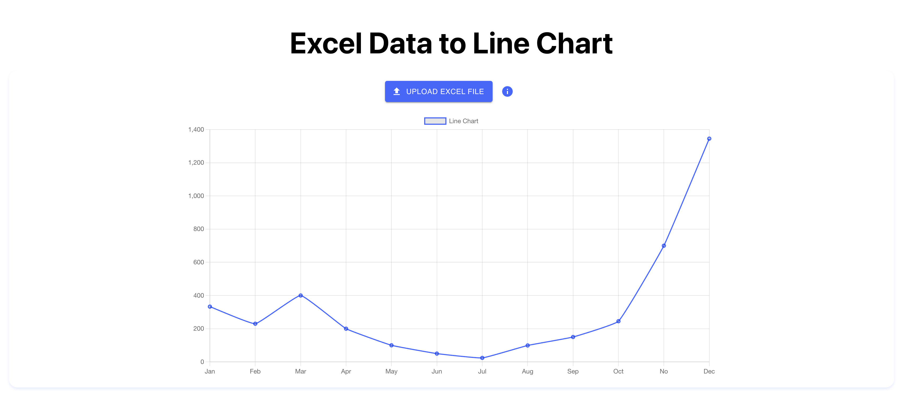

# Excel Data to Line Chart

## Description

This application allows users to upload an Excel file and visualize the data in a line chart.

## Installation

1. Clone the repository.
2. Run `npm install` or `yarn install` to install dependencies.

## Usage

1. Start the application with `npm start` or `yarn start`.
2. Upload an Excel file with x-axis values in the first column and y-axis values in the second column to view the line chart.

## Contributing

If you'd like to contribute, please fork the repository and submit a pull request.

## License

This project is licensed under the MIT License - see the [LICENSE](LICENSE) file for details.
